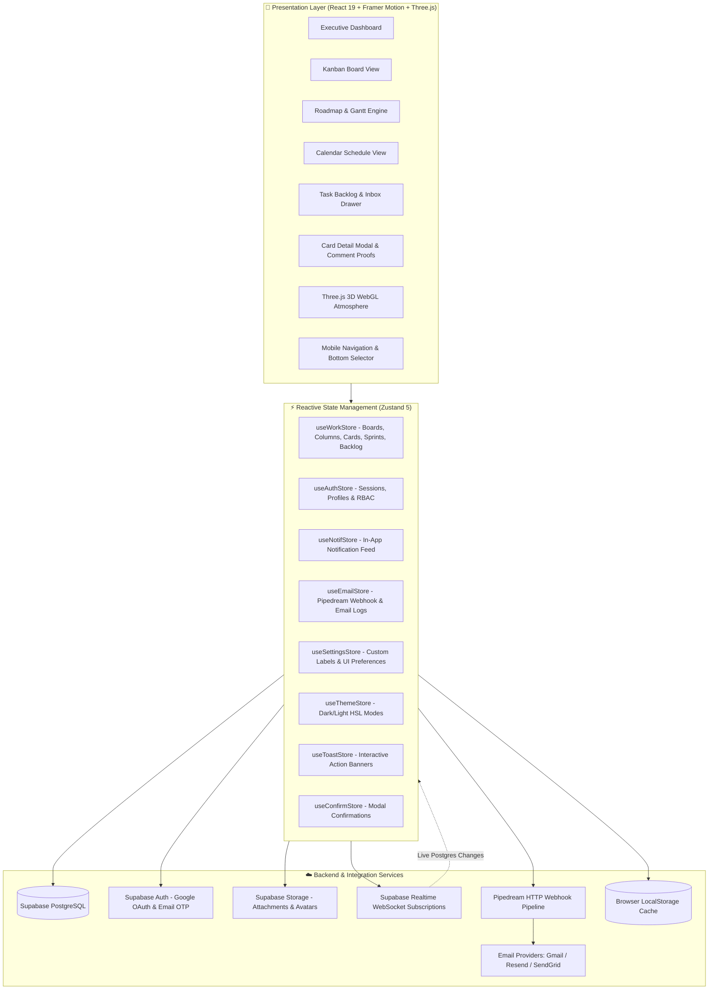
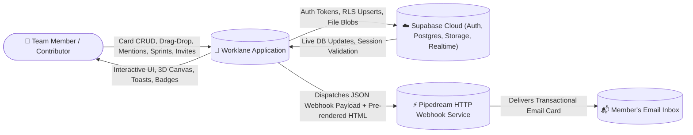
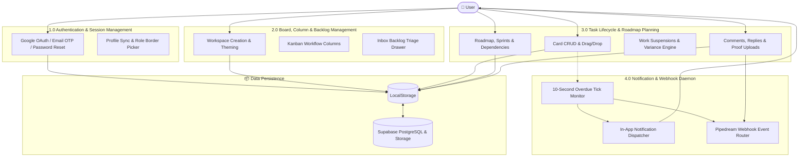

<div align="center">

  

  <br />

  <h1>🚀 Worklane</h1>
  <p><strong>A Next-Generation Neumorphic Project Management & Collaborative Workspace</strong></p>

  <p>
    <a href="https://react.dev/"></a>
    <a href="https://www.typescriptlang.org/"></a>
    <a href="https://vitejs.dev/"></a>
    <a href="https://tailwindcss.com/"></a>
    <a href="https://threejs.org/"></a>
    <a href="https://supabase.com/"></a>
    <a href="https://zustand.docs.pmnd.rs/"></a>
    <a href="https://www.framer.com/motion/"></a>
    <a href="https://pipedream.com/"></a>
  </p>

</div>

---

## 📖 Table of Contents
1. [Overview](#-overview)
2. [Key Features](#-key-features)
   - [Multi-Board & Workspace Dashboard](#1-multi-board--workspace-dashboard)
   - [Productivity Views: Kanban, Roadmap & Calendar](#2-multi-view-productivity-modes)
   - [Interactive Roadmap & Gantt Timeline Engine](#3-interactive-roadmap--gantt-timeline-engine)
   - [Task Backlog & Inbox Drawer](#4-task-backlog--inbox-drawer)
   - [Interactive 3D WebGL Atmosphere (Three.js)](#5-interactive-3d-webgl-atmosphere-threejs)
   - [Real-Time Due Date Engine & Overdue Detection](#6-real-time-due-date-engine--overdue-detection)
   - [Automated Email Notifications via Pipedream](#7-automated-email-notifications-via-pipedream-webhooks)
   - [Team Collaboration, @Mentions & Role-Based Permissions (RBAC)](#8-team-collaboration--role-based-permissions-rbac)
   - [Profile Personalization & Role Borders](#9-profile-personalization--custom-role-borders)
   - [Global Command Palette & Quick Search](#10-global-command-palette--quick-search)
   - [Mobile-Optimized Experience](#11-mobile-optimized-experience)
3. [Design System & Aesthetics](#-design-system--aesthetics)
4. [System Architecture](#-system-architecture)
5. [Data Flow Diagrams (DFD)](#-data-flow-diagrams-dfd)
   - [Level 0: Context Diagram](#level-0-context-diagram)
   - [Level 1: System Process Decomposition](#level-1-system-process-decomposition)
6. [User Stories & Acceptance Criteria](#-user-stories)
7. [Tech Stack](#-tech-stack)
8. [Project Structure](#-project-structure)
9. [Database Schema (Supabase)](#-database-schema-supabase)
10. [Automated Email Setup (Pipedream)](#-automated-email-setup-pipedream)
11. [Getting Started & Local Development](#-getting-started)
12. [Environment Variables](#-environment-variables)
13. [License](#-license)

---

## 🌟 Overview

**Worklane** is an ultra-tactile, high-performance project management workspace engineered with React 19, TypeScript, Vite, Tailwind CSS v4, Three.js, and a bespoke Neumorphic design system. Designed for agile engineering squads, product teams, and high-velocity creators, Worklane marries tactile physical feedback with multi-view productivity (Kanban, Roadmap/Gantt timeline, Calendar, and Backlog Inbox), real-time Supabase cloud synchronization, automated transactional email alerts via Pipedream, and an interactive 3D WebGL visual environment.

Worklane operates with zero-latency optimistic local state persisted in `localStorage` alongside real-time PostgreSQL subscriptions and storage integration powered by **Supabase**.

---

## ✨ Key Features

### 🗂️ 1. Multi-Board & Workspace Dashboard
- **Centralized Dashboard**: Provides executive KPI counters across all active boards—Total Tasks, Due Soon / Overdue, Completion Rate, and Active Workspaces.
- **Cross-Board Task Aggregator**: Consolidated task table with filters (`All`, `Assigned to Me`, `Due Soon`, `Urgent`, `Completed`), quick status toggles, and direct-to-card navigation.
- **Custom Board Theming**: Color-code boards using a rich 12-color HSL palette (`Indigo`, `Purple`, `Pink`, `Rose`, `Orange`, `Amber`, `Emerald`, `Teal`, `Sky`, `Blue`, `Slate`, `Zinc`).
- **Dynamic Topbar Navigation**: Context-aware breadcrumbs, active board switchers, quick invite triggers, and responsive layout controllers.

### 📋 2. Multi-View Productivity Modes
- **Fluid Kanban View**: Drag-and-drop task cards across customizable workflow columns (e.g., *To Do*, *In Progress*, *Review*, *Done*) with automatic `completed` flag updates on drop into completion columns.
- **Interactive Calendar View**: Full monthly schedule matrix plotting deadline badges, priority markers, overdue alerts, and single-click modal inspections.
- **Roadmap & Gantt Timeline View**: Dedicated milestone, sprint, and timeline visualization engine for tracking complex delivery schedules.

### 🗺️ 3. Interactive Roadmap & Gantt Timeline Engine
- **Sprint Management**: Plan, execute, and complete structured sprints with target milestone ranges and sprint goal indicators.
- **Adjustable Time Scales**: Seamlessly zoom and pan between **Days**, **Weeks**, and **Months**.
- **Dynamic Grouping**: Group timeline tasks by **Sprint**, **Workflow Column**, **Assignee**, or **Custom Label**.
- **Task Dependencies & Progress Tracking**: Visualize upstream/downstream blockers with dependency linking and 0–100% completion progress indicators.
- **Work Suspensions & Schedule Variance Analysis**:
  - Log contiguous pauses (e.g., client review holds, vendor delays, holiday shutdowns).
  - Automatically subtracts paused periods from total duration to compute true active working days.
  - Computes real-time schedule variance (planned vs. actual elapsed duration).
  - One-click export of roadmap timeline and variance data to CSV.
  - 📖 *For the complete workspace and user guide, see [`USER_MANUAL.md`](USER_MANUAL.md).*
  - 📖 *For technical standards & variance formulas, see [`GANTT_SPECIFICATION.md`](GANTT_SPECIFICATION.md).*
  - 📘 *For step-by-step instructions on using the Roadmap & Gantt features, see [`GANTT_USER_MANUAL.md`](GANTT_USER_MANUAL.md).*

### 📥 4. Task Backlog & Inbox Drawer
- **Dockable / Sliding Backlog Drawer**: Triage raw ideas, incoming bug reports, and unstructured notes before promoting them to workflow columns.
- **Bidirectional Drag-and-Drop**: Drag cards seamlessly between the Inbox Backlog and Kanban columns.
- **Isolated Backlog Search**: Search, filter, and prioritize backlog items without cluttering active board columns.

### 🌐 5. Interactive 3D WebGL Atmosphere (Three.js)
- **Physically Rendered 3D Ribbons**: Custom Three.js scene rendered across login and loading screens featuring smooth sinusoidal wave deformers.
- **Dynamic Lighting & Shading**: ACES Filmic tone mapping, ambient illumination, directional key light, cyan/purple rim lights, and floating dust particle systems with additive blending.
- **Interactive Mouse Parallax**: Fluid camera tracking reacting to cursor movement and viewport tilt.
- **Theme-Adaptive Shaders**: Automatic real-time color and fog transitions between Dark and Light neumorphic modes.

### ⏰ 6. Real-Time Due Date Engine & Overdue Detection
- **Tactile Neumorphic Date & Time Picker**: 12-hour analog clock selector, AM/PM switcher, and instant presets (`Today`, `Tomorrow`, `End of Week`, `Next Week`).
- **10-Second Real-Time Tick Daemon**: Background daemon constantly evaluates card due dates against the system clock, instantly promoting tags from amber (`Due Soon`) to glowing red (`Overdue`).
- **Targeted Notification Routing**: Alerts and emails are routed exclusively to assignees on each card, preventing notification fatigue.

### 📧 7. Automated Email Notifications via Pipedream Webhooks
- **Zero-Friction Transactional Delivery**: Connects to Pipedream HTTP Webhooks to deliver emails through Gmail, Resend, SendGrid, or custom SMTP without complex backend servers.
- **Pre-Rendered HTML Templates**: Responsive email cards styled with Worklane branding, dynamic event badges, metadata summaries, and deep-link CTA buttons.
- **Event-Driven Triggers**:
  - `card_assigned`: Alert members when assigned to a task.
  - `due_reminder`: Notify members when deadlines are nearing or breached.
  - `status_changed`: Send status transitions (e.g. moved to Review or Completed).
  - `mention`: Instantly email users tagged with `@username` in discussions.
  - `test_ping`: Manual webhook validation test from Settings.
- **Integrated Audit Log & Tester**: Review sent email records, status responses, and dispatch manual tests directly from **Settings &rarr; Email Updates**.

### 👥 8. Team Collaboration & Role-Based Permissions (RBAC)
- **Role Hierarchy**:
  - 👑 **Owner**: Full board governance, member permissions, board color/deletion controls.
  - 🛡️ **Admin**: Column operations, card management, member invitations, and role delegation.
  - 👤 **Member**: Standard active contributor with card creation, editing, assignment, and commenting capabilities.
  - 👁️ **Observer (View-Only)**: Read-only access for stakeholders, clients, or auditors with interactive card viewing.
- **Member Invitations**:
  - Direct user search to add registered accounts by email.
  - Shareable role-specific invitation links (`?joinBoard=<id>&role=admin|member|observer`).
  - Dedicated `InviteLandingPage` with inline Google OAuth or email sign-up.
- **Discussions & Mention System**:
  - Comment threads with nested replies.
  - Proof and screenshot attachments directly within comment replies.
  - Autocomplete `@mention` dropdown dispatching instant in-app alerts and webhook emails.

### 🎭 9. Profile Personalization & Custom Role Borders
- **Avatar Cropper Modal**: Upload custom profile pictures with built-in crop, pan, and zoom controls.
- **Curated Avatar Library**: Built-in high-resolution avatar presets.
- **Role Border Ring Engine**: Distinctive glowing gradient borders and badge tags for engineering and workplace roles:
  - *Engineering*: Frontend (`FE`), Backend (`BE`), Fullstack (`FS`), DevOps (`DevOps`), Mobile (`Mobile`), QA (`QA`), Data/AI (`Data`), Security (`SecOps`).
  - *Workplace*: UI/UX Design (`UI/UX`), Product Manager (`PM`), Scrum Master (`Scrum`), Tech Lead (`Lead`), Business Analyst (`BA`), Growth/Marketing (`Growth`), IT Operations (`Ops`).

### 🔍 10. Global Command Palette & Quick Search
- Access instantly with <kbd>Ctrl</kbd> + <kbd>K</kbd> / <kbd>Cmd</kbd> + <kbd>K</kbd>.
- Fuzzy search across board names, card titles, rich descriptions, assignees, and label tags.
- Direct navigation into card detail modals from search results.

### 📱 11. Mobile-Optimized Experience
- **Responsive Mobile Navigation (`MobileBottomNav`)**: Dedicated bottom tab bar for Dashboard, Active Board, Calendar, and Inbox.
- **Neumorphic Center FAB**: Prominent extruded plus button for rapid board and card creation on touch screens.
- **Mobile Board Selector**: Touch-friendly bottom drawer for switching workspaces on handheld devices.

---

## 🎨 Design System & Aesthetics

Worklane is engineered with a **Soft Neumorphic & Glassmorphic** visual aesthetic:
- **Tailored Light & Dark Tokens**: Complete HSL-driven token design system with CSS custom properties.
- **Dual-Layer Inset & Extruded Elevation**: High-precision multi-box-shadow combinations (`var(--neu-shadow-raised-sm)`, `var(--neu-shadow-raised-md)`, `var(--neu-shadow-inset)`).
- **Physical Micro-Animations**: Powered by **Framer Motion** for spring modals, 3D card tilt physics, smooth drawer slide-ins, and animated toast alerts.
- **Custom Neumorphic Form Controls**: Custom styled date pickers, dropdown selects, border pickers, and toggle switches.

---

## 🏗️ System Architecture

Worklane utilizes a modular reactive architecture featuring unidirectional state flow, client caching, and real-time cloud synchronization.



---

## 🔄 Data Flow Diagrams (DFD)

### Level 0: Context Diagram



---

### Level 1: System Process Decomposition



---

## 📝 User Stories

### Persona 1: Project Manager / Team Lead
| ID | User Story | Acceptance Criteria |
| :--- | :--- | :--- |
| **US-01** | **As a** Project Manager, **I want to** schedule tasks across Sprints and view them on a Gantt timeline, **so that** I can track deliverable milestones and dependencies. | • Roadmap view renders tasks across Days, Weeks, and Months.<br>• Tasks display progress percentage and dependency connections. |
| **US-02** | **As a** Team Lead, **I want to** record work suspensions on tasks, **so that** paused days are deducted from schedule variance metrics. | • Users can log pause date ranges with reasons (e.g. client hold).<br>• Net elapsed working days and variance update automatically and export to CSV. |
| **US-03** | **As a** Project Manager, **I want** assignees to receive automated emails when tasks are assigned or overdue, **so that** deadlines are never missed. | • Triggers automated HTTP POST to Pipedream webhook with pre-rendered HTML.<br>• Assignees receive branded email notifications in their inbox. |

### Persona 2: Developer / Contributor
| ID | User Story | Acceptance Criteria |
| :--- | :--- | :--- |
| **US-04** | **As a** Developer, **I want to** triage raw ideas in a Backlog Inbox drawer before assigning them to board columns, **so that** active columns stay clean. | • Backlog drawer slides out or docks to the right side of the screen.<br>• Cards can be dragged bidirectionally between Inbox and columns. |
| **US-05** | **As a** Developer, **I want to** tag colleagues with `@name` and attach screenshot proofs to comment replies, **so that** code review discussions are clear. | • Typing `@` opens autocomplete list of board members.<br>• Comments support nested replies, file attachments, and image previews. |
| **US-06** | **As a** Contributor, **I want to** select my professional role and show an animated border around my avatar, **so that** teammates recognize my domain. | • Profile settings allows selecting tech (FE, BE, DevOps) or workplace roles.<br>• Glowing role badge and gradient border appears across all avatars. |

### Persona 3: Stakeholder / Client Observer
| ID | User Story | Acceptance Criteria |
| :--- | :--- | :--- |
| **US-07** | **As an** Observer, **I want to** inspect board progress without accidentally altering tasks or columns, **so that** data integrity is maintained. | • Observer role enforces read-only controls on cards, columns, and settings.<br>• Observers can search, filter, and inspect modals freely. |
| **US-08** | **As a** User on a mobile device, **I want** a dedicated bottom navigation bar with a quick create button, **so that** I can manage tasks on mobile. | • Mobile bottom bar provides one-tap navigation to Home, Board, Calendar, and Inbox.<br>• Center FAB triggers rapid board creation modal. |

---

## 💻 Tech Stack

| Technology | Version | Purpose |
| :--- | :--- | :--- |
| **React** | `19.1.0` | High-concurrency UI rendering and component hierarchy |
| **TypeScript** | `5.8.3` | Strict end-to-end typing, interfaces, and compile-time guarantees |
| **Vite** | `6.3.5` | Next-generation dev server with rapid HMR and optimized Rollup production bundler |
| **Tailwind CSS** | `4.1.11` | Modern utility framework integrated via `@tailwindcss/vite` |
| **Three.js** | `0.185.1` | WebGL 3D scene rendering, ribbon geometry, ACES Filmic lighting, and particle dust |
| **Zustand** | `5.0.5` | Lightweight unidirectional state management with localStorage persistence |
| **Framer Motion** | `13.1.1` | Tactile spring physics, 3D card tilt, and page transitions |
| **Supabase Client** | `2.112.4` | PostgreSQL database, Auth (OAuth + OTP), Storage buckets, and Realtime subscriptions |
| **Pipedream Webhook** | — | Webhook pipeline delivering automated transactional HTML emails |
| **Lucide Icons** | `1.34.0` | Comprehensive vector iconography |

---

## 📁 Project Structure

```text
worklane/
├── assets/                          # Static branding, banner, and preview media
├── public/                          # Static web assets and favicons
├── src/
│   ├── assets/                      # Application logo and sidebar imagery
│   ├── components/
│   │   ├── mobile/                  # Mobile-first responsive navigation components
│   │   │   ├── MobileBoardSelector.tsx
│   │   │   ├── MobileBottomNav.tsx
│   │   │   └── index.ts
│   │   ├── modals/                  # Interactive overlay dialogs
│   │   │   ├── AddColumnModal.tsx
│   │   │   ├── AvatarCropperModal.tsx
│   │   │   ├── ConfirmModal.tsx
│   │   │   ├── CreateBoardModal.tsx
│   │   │   ├── PrivacyModal.tsx
│   │   │   ├── SearchModal.tsx
│   │   │   └── SettingsModal.tsx
│   │   ├── ui/                      # Reusable Neumorphic UI design system components
│   │   │   ├── AvatarBorder.tsx
│   │   │   ├── BoardColorPicker.tsx
│   │   │   ├── NeumorphicDatePicker.tsx
│   │   │   ├── NeumorphicSelect.tsx
│   │   │   ├── ProfileBorderPicker.tsx
│   │   │   └── Tilt3D.tsx
│   │   ├── AppLoadingScreen.tsx     # Three.js 3D loading overlay
│   │   ├── BoardArea.tsx            # Main board container (Kanban, Roadmap, Calendar)
│   │   ├── Card.tsx                 # Neumorphic Kanban card component
│   │   ├── CardModal.tsx            # Full task editor (proofs, dates, suspensions, @mentions)
│   │   ├── Column.tsx               # Drag-and-drop workflow column
│   │   ├── Dashboard.tsx            # Executive cross-board dashboard and KPI hub
│   │   ├── EmailNotifModal.tsx      # Email notification logs and manual dispatcher
│   │   ├── InboxDrawer.tsx          # Dockable task backlog triage drawer
│   │   ├── InviteLandingPage.tsx    # Board invite accept & onboarding flow
│   │   ├── LoginPage.tsx            # Auth portal with 3D WebGL background
│   │   ├── MembersModal.tsx         # Member role management & invite generator
│   │   ├── NotifPanel.tsx           # In-app notification popover
│   │   ├── RoadmapView.tsx          # Gantt roadmap, sprints, milestones & variance engine
│   │   ├── Sidebar.tsx              # Workspace sidebar with board listing
│   │   ├── ThreeDBackground.tsx     # WebGL 3D ribbon and lighting canvas
│   │   ├── Toast.tsx                # Action toast notification banner
│   │   └── Topbar.tsx               # Context-aware navigation topbar
│   ├── lib/
│   │   └── supabase.ts              # Supabase client initialization
│   ├── services/
│   │   └── supabaseService.ts       # Cloud data access layer & realtime handlers
│   ├── store/                       # Zustand store modules
│   │   ├── useAuthStore.ts
│   │   ├── useConfirmStore.ts
│   │   ├── useEmailStore.ts
│   │   ├── useNotifStore.ts
│   │   ├── useSettingsStore.ts
│   │   ├── useThemeStore.ts
│   │   ├── useToastStore.ts
│   │   └── useWorkStore.ts
│   ├── styles/                      # Neumorphic CSS token system & mobile overrides
│   │   ├── index.css
│   │   └── mobile.css
│   ├── App.tsx                      # Root application router & lifecycle controller
│   ├── main.tsx                     # React DOM entry point
│   ├── types.ts                     # Domain TypeScript definitions & constants
│   ├── utils.ts                     # Date formatters, initials, ID generators
│   └── vite-env.d.ts
├── .env.example                     # Environment template (Supabase + Pipedream)
├── index.html                       # HTML5 shell with Google Font preloading
├── package.json                     # Dependencies and scripts
├── PIPEDREAM_SETUP_GUIDE.md         # Dedicated webhook email configuration walkthrough
├── supabase_schema.sql              # Complete PostgreSQL schema, functions, triggers, and RLS
├── tsconfig.json                    # TypeScript compiler configuration
└── vite.config.ts                   # Vite configuration with Tailwind CSS v4 & React
```

---

## 🗄️ Database Schema (Supabase)

Worklane includes a comprehensive SQL schema in [`supabase_schema.sql`](supabase_schema.sql) configured for immediate execution in your **Supabase Dashboard &rarr; SQL Editor**:

- **Tables**:
  - `profiles`: User information, custom avatars, and role border styles (`border_style`).
  - `boards`: Workspaces with custom colors, creator IDs, and sprint configurations.
  - `board_members`: Multi-tenant membership table with role privileges (`owner`, `admin`, `member`, `observer`).
  - `columns`: Workflow columns with explicit ordering indexes.
  - `cards`: Tasks supporting start dates, due dates, completion timestamps, milestones, progress %, dependencies, work suspensions, and inbox flags.
  - `card_assignees` & `card_labels`: Relational joins for multiple assignees and labels.
  - `custom_labels`: Workspace-specific custom labels.
  - `attachments`: File attachments stored in Supabase Storage.
  - `comments`: Discussion comments with parent-child reply relationships and proof attachments.
  - `notifications`: In-app notification records.
  - `email_logs`: Transactional email audit logs.
- **Security & Triggers**:
  - Row Level Security (RLS) policies enforcing multi-tenant isolation.
  - `handle_new_user()` PostgreSQL trigger auto-creating profiles upon user registration.
  - Realtime publication on all primary tables for multi-device sync.

---

## 📧 Automated Email Setup (Pipedream)

Worklane features a zero-backend email architecture using **Pipedream HTTP Webhooks**:

1. Create a free HTTP Webhook trigger on [Pipedream](https://pipedream.com).
2. Set your webhook URL in `.env`:
   ```env
   VITE_PIPEDREAM_WEBHOOK_URL=https://eoxxxxxxxxx.m.pipedream.net
   ```
3. Add a "Send Email" action in your Pipedream workflow (connect to Gmail, Resend, or SendGrid) and map the payload body (`{{steps.trigger.event.body.html}}`).
4. Every board assignment, approaching deadline, comment `@mention`, or status update automatically dispatches a responsive branded email card to team members.

> 📖 For an in-depth walkthrough with payload schemas and step-by-step screenshots, see [**`PIPEDREAM_SETUP_GUIDE.md`**](PIPEDREAM_SETUP_GUIDE.md).

---

## 🚀 Getting Started

### 1. Prerequisites
- **Node.js**: Version `18.0.0` or higher
- **npm**: Version `9.0.0` or higher (or `pnpm` / `yarn`)

### 2. Clone & Install
```bash
git clone https://github.com/nyxieeee/Worklane.git
cd Worklane
npm install
```

### 3. Configure Environment Variables
Copy the template configuration file:
```bash
cp .env.example .env
```

Open `.env` and configure your credentials:
```env
# Supabase Configuration (Required for cloud sync & authentication)
VITE_SUPABASE_URL=https://your-project-id.supabase.co
VITE_SUPABASE_ANON_KEY=your-anon-public-key-here

# Pipedream Webhook Integration (Optional: for automated transactional emails)
VITE_PIPEDREAM_WEBHOOK_URL=https://eoxxxxxxxxx.m.pipedream.net
```

### 4. Initialize Database
1. Navigate to your [Supabase Dashboard](https://supabase.com/dashboard).
2. Open the **SQL Editor**.
3. Copy and run the entire content of [`supabase_schema.sql`](supabase_schema.sql).
4. *(Optional)* In **Authentication &rarr; URL Configuration**, add your local URL (`http://localhost:5173`) and production domain to the **Redirect URLs**.

### 5. Launch Development Server
```bash
npm run dev
```
Open [http://localhost:5173](http://localhost:5173) in your browser.

### 6. Build for Production
To build an optimized production bundle:
```bash
npm run build
```

To preview the production build locally:
```bash
npm run preview
```

---

## ⚙️ Environment Variables

| Variable | Required | Description |
| :--- | :---: | :--- |
| `VITE_SUPABASE_URL` | **Yes** | The HTTPS API URL for your Supabase project (from Project Settings &rarr; API). |
| `VITE_SUPABASE_ANON_KEY` | **Yes** | The public anonymous API key for client-side queries and authentication. |
| `VITE_PIPEDREAM_WEBHOOK_URL` | *Optional* | HTTP Webhook endpoint from Pipedream to receive event payloads and deliver automated HTML emails. |

---

## 📄 License

Distributed under the **MIT License**. See `LICENSE` for more information.

<div align="center">
  <sub>Built with ❤️ by Uno for productive teams worldwide.</sub>
</div>
